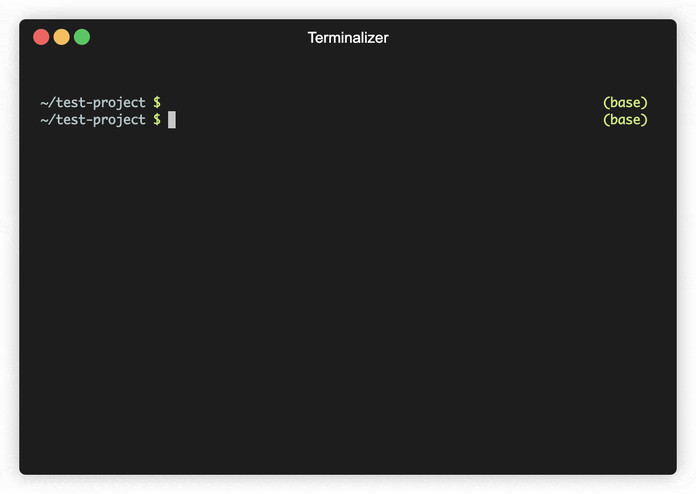

# awstrainer

🛠️ Command line tools for machine learning on AWS

awstrainer helps you run machine learning tasks (or any other long-running computations) 
on AWS. With one simple command, it spins up an AWS instance (from your own account), 
transfers your code & dataset, starts the training run, syncs all output files back to 
your computer, and terminates the instance after training has finished. It really shines 
when you need to quickly launch multiple, long-running jobs in parallel (e.g. for 
hyperparameter optimization). 

## Demo

THIS DEMO IS OLD AND NEEDS TO BE UPDATED

## Installation

1. `pip install git+https://github.com/jrieke/awstrainer`

2. Install the AWS CLI from [here](https://docs.aws.amazon.com/cli/latest/userguide/install-cliv2.html) 
and run `aws configure` to [connect your AWS account](https://docs.aws.amazon.com/cli/latest/userguide/cli-configure-quickstart.html)) (alternatively, you can create a credentials file as 
described [here](https://boto3.amazonaws.com/v1/documentation/api/latest/guide/quickstart.html#configuration)). 

## Usage

### Starting a training run

First, you need to create a launch template for your AWS instance. This specifies which 
instance type should be used, how big the storage is, which packages should be 
installed, etc. You can either follow the instructions [here](https://docs.aws.amazon.com/AWSEC2/latest/UserGuide/ec2-launch-templates.html#create-launch-template) or create a launch 
template [from an existing instance](https://docs.aws.amazon.com/AWSEC2/latest/UserGuide/ec2-launch-templates.html#create-launch-template-from-instance). 

Then, navigate into your project dir and run:

    awstrainer run --launch_template_id <id> "python train.py"

This launches an AWS instance (based on your launch template), uploads the project dir 
(excluding subdirs `.git` and `out`), executes a command via ssh (here: 
`python train.py`, but this can be any command), and terminates the instance after 
training has finished. Note that this assumes your private key file from AWS to be 
stored as `aws-key.pem` in the project dir. To adapt this, set the `--key_file` option. 
Based on which operating system your instance uses, you may also need to set the 
`--user` option (default: `ubuntu`). 

For a complete list of options, run `awstrainer run --help`. 

### Syncing output back to your machine

awstrainer also allows you to sync any output files from the AWS instances back to your
local machine. For this to work, you need to write output files to a folder `out`. 
Then, on your local machine, run:

    awstrainer sync --every 60

This pulls output files from all running AWS instances every 60 seconds and syncs them 
to a local dir `aws-synced-out`. You can also run `awstrainer sync` without the 
`--every` option for a one-time sync. 

For a complete list of options, run `awstrainer sync --help`. 

## Known issues

If the `train-on-aws.sh` script shows a "Connection refused" error, try increasing the 
waiting time in the script. Sometimes, the instance doesn't allow a connection even 
though the AWS API reports it as ready, which may lead to this type of error. 

